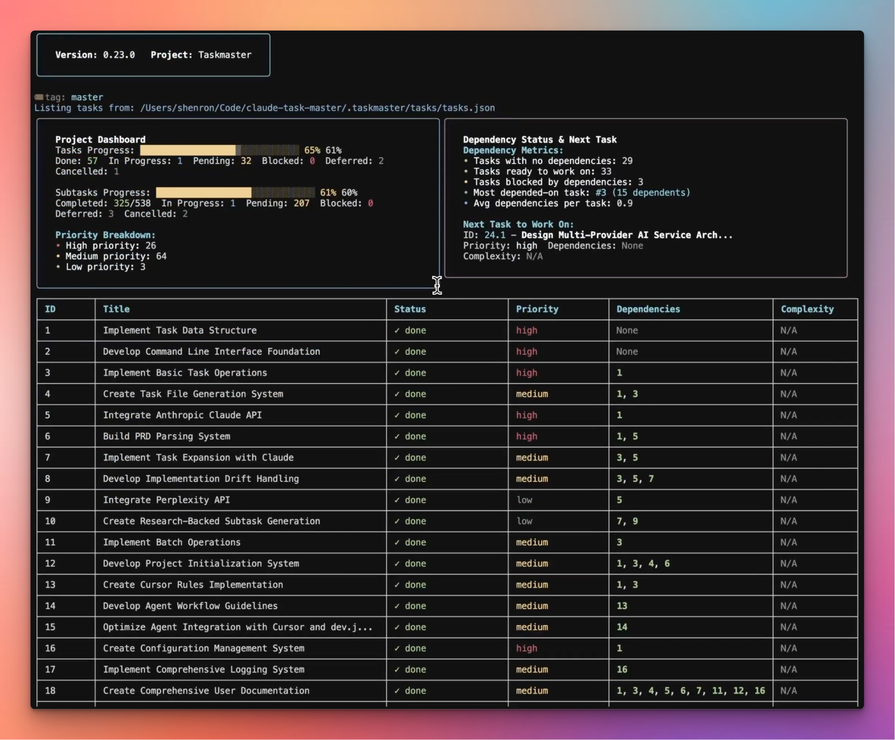

# Taskboard

[](https://www.npmjs.com/package/taskboard)
[](https://opensource.org/licenses/MIT)
[](https://nodejs.org/)
[](https://www.npmjs.com/package/taskboard)
[](https://github.com/shokks/taskboard)
[](https://github.com/shokks/taskboard/issues)

A real-time Kanban dashboard for [TaskMaster AI](https://github.com/eyaltoledano/claude-task-master) projects. This tool provides a beautiful, live visualization of your TaskMaster AI tasks, automatically updating as your AI-assisted development workflow progresses.

TaskMaster AI, created by [Eyal Toledano](https://github.com/eyaltoledano), is an AI-powered project management system that breaks down complex software development projects into manageable, structured tasks. It integrates seamlessly with AI-driven development environments like Cursor AI, Windsurf, Roo, and others, helping maintain context and organization throughout the development process.

**This taskboard serves as the perfect visual companion**, transforming your structured TaskMaster AI tasks into an intuitive Kanban board that updates in real-time. Whether you're working with Claude, Cursor AI, or other AI assistants, you'll have a live dashboard showing exactly where your project stands - making AI-assisted development more organized and productive than ever.

## From Raw JSON to Beautiful Dashboard

Transform your TaskMaster AI experience from overwhelming JSON files to intuitive visual project management.

### Before: TaskMaster AI Tasks (Raw JSON)

*Raw TaskMaster AI tasks.json file - functional but difficult to navigate, understand, and share with your team*

### After: Taskboard Dashboard

*The same tasks transformed into a beautiful, intuitive Kanban dashboard with real-time updates, progress tracking, metrics, and professional presentation*

**The Transformation:**
- **📊 Instant Project Insights**: See progress, bottlenecks, and priorities at a glance instead of parsing JSON manually
- **🎨 Professional Presentation**: Perfect for client demos, team standups, and stakeholder updates
- **⚡ Real-time Intelligence**: Live metrics, progress bars, and status indicators vs static text files
- **🧭 Intuitive Navigation**: Organized Kanban columns instead of nested JSON structures
- **👥 Team-Friendly**: Share visual dashboards instead of asking team members to read raw JSON

## Features

- 📋 **Live Kanban Visualization**: Transform TaskMaster AI tasks into a beautiful Kanban board
- 🔄 **Real-time Updates**: Automatically refreshes when TaskMaster AI updates your tasks.json
- 🎯 **Complete Task Details**: View titles, descriptions, priorities, subtasks, and dependencies
- 🤖 **AI Development Workflow**: Perfect companion for AI-assisted development with Claude, Cursor, and others
- 🚀 **Zero Configuration**: Works immediately with any TaskMaster AI project
- 🔌 **Non-intrusive**: Runs independently without affecting your development workflow
- 🌐 **Multi-project Support**: Each TaskMaster AI project gets its own dashboard instance

## Prerequisites

- Node.js 16 or higher
- A project with [TaskMaster AI](https://github.com/eyaltoledano/claude-task-master) initialized
- The `.taskmaster/tasks/tasks.json` file created by TaskMaster AI

### Setting up TaskMaster AI First

If you haven't set up TaskMaster AI yet, visit the [official repository](https://github.com/eyaltoledano/claude-task-master) for installation instructions. TaskMaster AI can be integrated as:

- An MCP server with Claude Desktop
- A project management system within Cursor AI, Windsurf, Roo, and other AI development environments
- A standalone task management tool for AI-assisted development projects

## Installation

```bash
npm install -g taskboard
```

Or with yarn:

```bash
yarn global add taskboard
```

## Usage

Navigate to any TaskMaster AI-enabled project and run:

```bash
cd /path/to/your/taskmaster-project
taskboard serve
```

The dashboard will automatically:
1. Find an available port (default: 5000)
2. Start watching your `.taskmaster/tasks/tasks.json` file
3. Open your browser to the live dashboard

### Command Options

```bash
taskboard serve [options]

Options:
  -p, --port <number>    Port to run the server on (default: 5000)
  -o, --no-open         Don't open browser on start
  -w, --watch <path>    Path to watch for tasks.json (default: current directory)
  -h, --help           Display help for command
```

### Examples

Run on a specific port:
```bash
taskboard serve --port 5050
```

Watch a different directory:
```bash
taskboard serve --watch /path/to/project
```

Start without opening browser:
```bash
taskboard serve --no-open
```

## How It Works

1. TaskMaster AI manages your project tasks in `.taskmaster/tasks/tasks.json`
2. As you work with AI assistants (Claude, Cursor AI, etc.), TaskMaster AI updates task statuses
3. This dashboard watches the tasks file and reflects changes instantly
4. Tasks are displayed in columns: Pending, In Progress, Review, and Completed
5. You get a real-time visual overview of your AI-assisted development progress

## Task Visualization

The dashboard displays TaskMaster AI tasks with:

- **Title and Description**: Complete task information from TaskMaster AI
- **Priority Indicators**: 🔴 High, 🟡 Medium, 🟢 Low priority tasks
- **Task ID**: Unique identifiers matching TaskMaster AI's task system
- **Subtask Progress**: Visual progress bars showing completed/total subtasks
- **Dependencies**: Clear indication of task dependencies and blockers
- **Status Tracking**: Real-time status updates as AI assistants complete work

## Integration with AI Development Workflow

This dashboard enhances your AI-assisted development experience by:

- **Visual Context**: See all TaskMaster AI tasks at a glance while working with Claude or other AI assistants
- **Progress Tracking**: Monitor how AI-assisted work progresses through your project
- **Team Collaboration**: Share live dashboard views with team members
- **Project Overview**: Maintain big-picture awareness during detailed AI-assisted coding sessions

## Troubleshooting

### Dashboard shows "Tasks file not found"
- Ensure TaskMaster AI is initialized in your project: `npm install @taskmaster-ai/cli`
- Check that `.taskmaster/tasks/tasks.json` exists
- Verify you're running the command from the correct project root
- Refer to [TaskMaster AI documentation](https://github.com/eyaltoledano/claude-task-master/blob/main/docs/tutorial.md)

### Port already in use
- The dashboard will automatically find the next available port (5000-5999)
- Or specify a different port with `--port`

### Changes not reflecting
- Ensure TaskMaster AI is actively updating the tasks.json file
- Check that your AI assistant (Claude, Cursor AI, etc.) is properly integrated with TaskMaster AI
- Try refreshing the browser or restarting the dashboard

## Related Projects

- **[TaskMaster AI](https://github.com/eyaltoledano/claude-task-master)** - The main project management system this dashboard visualizes
- **[Task-Master.dev](https://task-master.dev)** - Official TaskMaster AI website and documentation
- **[Claude Desktop](https://claude.ai/desktop)** - AI assistant that integrates with TaskMaster AI via MCP
- **[Cursor AI](https://cursor.sh)** - AI-powered code editor with TaskMaster AI integration

## Development

To contribute to this visualization tool:

```bash
git clone https://github.com/shokks/taskboard.git
cd taskboard
npm install
npm run dev
```

## Credits

This project is a visualization companion for [TaskMaster AI](https://github.com/eyaltoledano/claude-task-master), created by [Eyal Toledano](https://github.com/eyaltoledano). TaskMaster AI revolutionizes AI-assisted development by providing structured task management that keeps AI agents focused and productive.

Special thanks to the TaskMaster AI community and the broader AI development ecosystem, including the teams behind Claude, Cursor AI, Windsurf, and other tools that make AI-assisted development possible.

## Version History

### v1.0.0 (Current)
*Initial Release - August 2025*

**🎉 Initial Features:**
- **Real-time Kanban Dashboard**: Live visualization of TaskMaster AI tasks with automatic updates
- **TaskMaster AI Integration**: Native support for `.taskmaster/tasks/tasks.json` file monitoring
- **Enhanced Task Cards**: Expandable cards with detailed task information, subtasks, and dependencies
- **Modern UI**: Built with shadcn/ui components, React, and TailwindCSS
- **Dark Mode Support**: Full dark mode compatibility with improved contrast
- **Multi-project Support**: Independent dashboard instances per project
- **Zero Configuration**: Works immediately with any TaskMaster AI project

**🔧 Technical Highlights:**
- **CLI Tool**: Global npm package with `taskboard serve` command
- **Port Management**: Automatic port detection and conflict resolution (5000-5999 range)
- **File Watching**: Real-time monitoring with sub-second update responsiveness
- **Dynamic Columns**: Smart column visibility (Review column shows/hides based on task presence)
- **Responsive Design**: Mobile-friendly interface with collapsible header
- **TypeScript**: Full type safety and modern development experience

**📚 Documentation:**
- Comprehensive README with TaskMaster AI attribution
- Installation and usage instructions
- Troubleshooting guides and FAQ
- Integration examples for AI development workflows

**🎯 TaskMaster AI Ecosystem:**
- Proper attribution to [Eyal Toledano's TaskMaster AI project](https://github.com/eyaltoledano/claude-task-master)
- Integration guides for Claude, Cursor AI, Windsurf, and other AI development tools
- Links to official TaskMaster AI resources and documentation

## License

MIT

## Contributing

Contributions are welcome! This project aims to enhance the TaskMaster AI ecosystem with better visualization tools. Please feel free to submit issues and pull requests.

For TaskMaster AI core functionality, please contribute to the [main TaskMaster AI repository](https://github.com/eyaltoledano/claude-task-master).